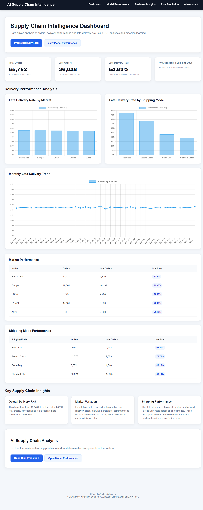
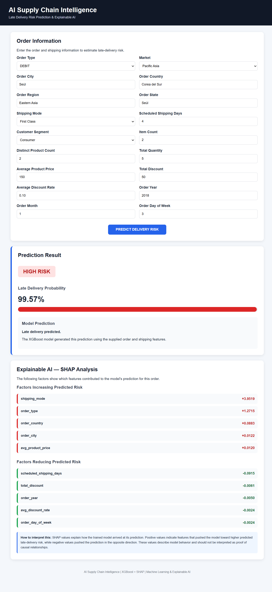
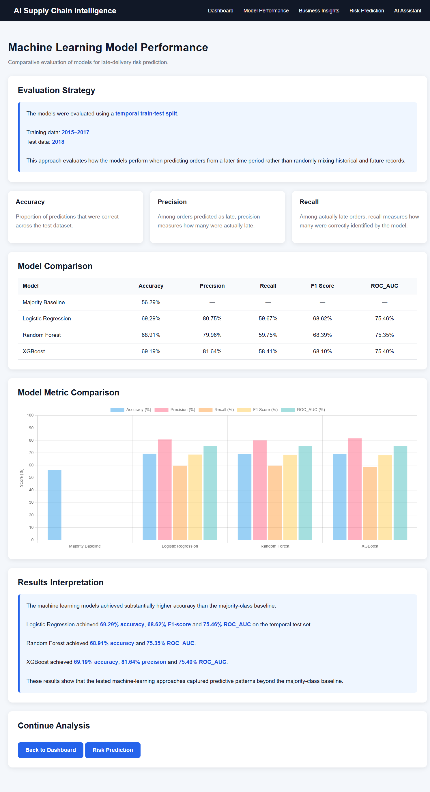
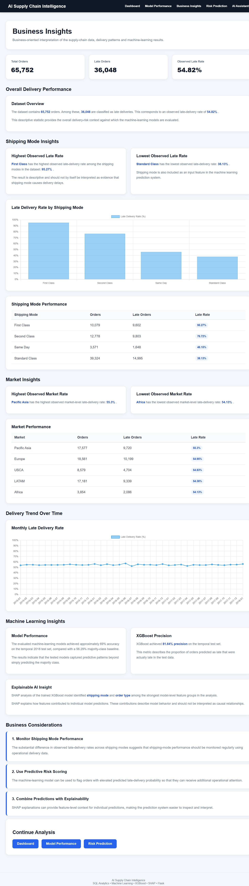
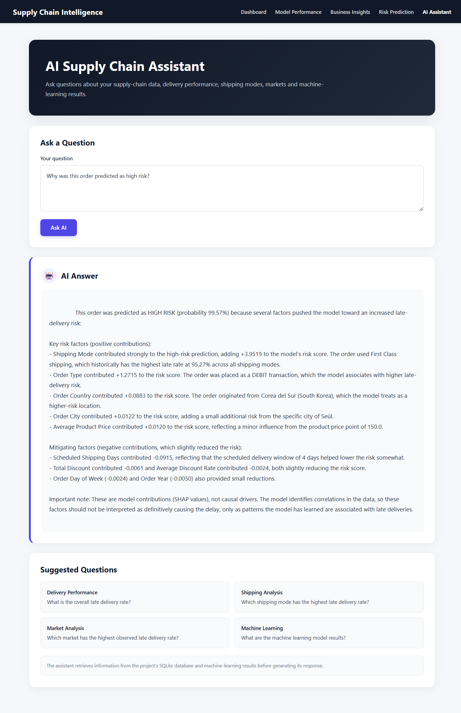

# AI Supply Chain Intelligence

An end-to-end AI-powered supply chain analytics and late-delivery risk prediction system built using SQL, Machine Learning, Explainable AI, Flask, and Generative AI.

## Project Overview

This project analyzes supply chain order data to identify delivery patterns, evaluate shipping performance, predict late-delivery risk, and provide explainable insights for business decision-making.

The system combines:

- SQL-based supply chain analytics
- Machine Learning
- XGBoost
- SHAP Explainable AI
- Flask web application
- Generative AI assistant
- Interactive business dashboards

## Key Features

### 1. Supply Chain Analytics

SQL analytics are used to analyze:

- Overall delivery performance
- Late-delivery rates
- Shipping modes
- Markets
- Monthly delivery trends
- Order-level business metrics

### 2. Machine Learning

The project evaluates multiple classification models:

- Majority Baseline
- Logistic Regression
- Random Forest
- XGBoost

A temporal train-test split is used:

- Training: 2015–2017
- Testing: 2018

The target variable is:

`late_delivery_risk`

### 3. Explainable AI

SHAP is used to explain model predictions.

The system identifies:

- Factors pushing predictions toward higher risk
- Factors pushing predictions toward lower risk
- Feature contributions for individual predictions
- Global feature importance

SHAP explanations are interpreted as model contributions rather than causal effects.

### 4. Risk Prediction

Users can enter order information through the Flask application and receive:

- Predicted delivery-risk class
- Late-delivery probability
- Risk level
- Positive contributing factors
- Negative contributing factors
- SHAP-based explanation

Risk levels used by the application:

- LOW
- MEDIUM
- HIGH

### 5. Business Intelligence Dashboard

The dashboard provides:

- Total orders
- Late orders
- Overall late-delivery rate
- Average scheduled shipping days
- Market-level performance
- Shipping-mode performance
- Monthly late-delivery trends

### 6. AI Supply Chain Assistant

A Generative AI assistant allows users to ask questions about the project data.

Example questions:

- Which shipping mode has the highest late-delivery rate?
- Which market has the highest observed late-delivery rate?
- What is the overall late-delivery rate?
- How do the machine-learning models compare?
- Why was this order predicted as high risk?
- What factors influenced this prediction?
- What business actions can be considered?

The assistant is grounded in project-specific analytics and prediction context.

## Dataset

The project uses the DataCo Supply Chain dataset.

The dataset contains supply-chain order, customer, product, shipping, sales, and delivery information.

The original dataset contains:

- 180,519 records
- 53 columns

For machine-learning prediction, the project creates an order-level dataset containing 65,752 orders.

## Machine Learning Features

The order-level model uses features including:

- Order Type
- Market
- Order City
- Order Country
- Order Region
- Order State
- Shipping Mode
- Scheduled Shipping Days
- Customer Segment
- Number of Items
- Number of Different Products
- Total Quantity
- Average Product Price
- Total Discount
- Average Discount Rate
- Order Year
- Order Month
- Order Day of Week

## Model Results

Evaluation is performed on the 2018 test set.

| Model | Accuracy | Precision | Recall | F1 | ROC-AUC |
|---|---:|---:|---:|---:|---:|
| Majority Baseline | 56.29% | — | — | — | — |
| Logistic Regression | 69.29% | 80.75% | 59.67% | 68.62% | 75.46% |
| Random Forest | 68.91% | 79.96% | 59.75% | 68.39% | 75.35% |
| XGBoost | 69.19% | 81.64% | 58.41% | 68.10% | 75.40% |

All tested machine-learning models improve on the majority-class baseline on the 2018 test set.

## Technology Stack

### Programming

- Python
- SQL
- HTML
- CSS
- JavaScript

### Machine Learning

- Scikit-learn
- XGBoost
- SHAP

### Data Analysis

- Pandas
- NumPy
- SQLite

### Web Application

- Flask

### Generative AI

- OpenRouter
- OpenAI-compatible API

### Development

- Visual Studio Code
- Jupyter Notebook
- Python Virtual Environment

## Project Architecture

```text
                    Supply Chain Dataset
                            |
                            v
                  Data Preprocessing
                            |
             +--------------+--------------+
             |                             |
             v                             v
       SQLite Database               ML Dataset
             |                             |
             v                             v
      SQL Analytics              Feature Engineering
                                           |
                                           v
                              Machine Learning Models
                                           |
                         +-----------------+----------------+
                         |                 |                |
                         v                 v                v
                  Logistic Regression  Random Forest    XGBoost
                                                           |
                                                           v
                                                     SHAP Explainability
                                                           |
                         +---------------------------------+
                         |
                         v
                   Flask Application
                         |
          +--------------+--------------+
          |              |              |
          v              v              v
      Dashboard    Risk Prediction   Business Insights
                                           |
                                           v
                                    AI Assistant


## Application Screenshots

### Supply Chain Intelligence Dashboard

The dashboard provides an overview of orders, delivery performance, shipping modes, markets, and monthly late-delivery trends.



### Late-Delivery Risk Prediction

The risk prediction interface uses XGBoost to estimate late-delivery probability and SHAP to explain the factors contributing to the prediction.



### Machine Learning Model Performance

The model performance page compares the tested classification models using a temporal train-test evaluation strategy.



### Business Insights

The business insights page presents supply-chain patterns derived from SQL analytics and machine-learning results.



### AI Supply Chain Assistant

The AI assistant allows users to ask natural-language questions about supply-chain analytics and individual model predictions.

